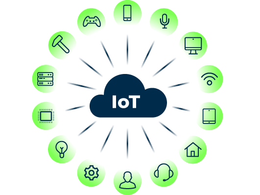
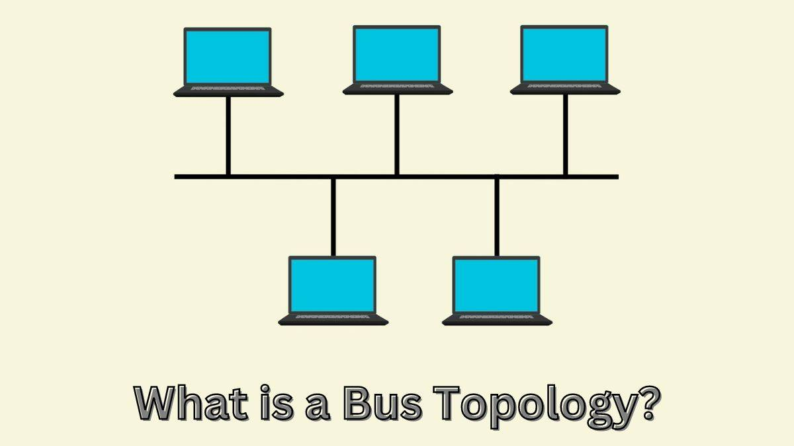
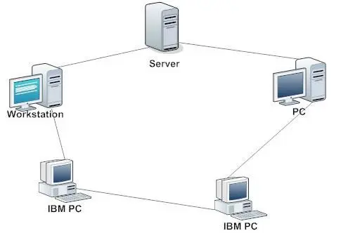
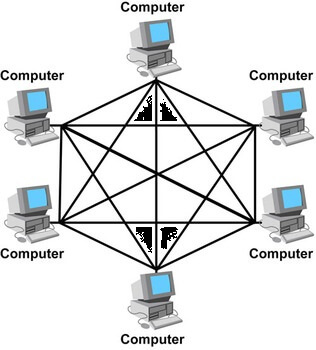

# **WHAT IS COMPUTER NETWORKING?**
Computer networking, is the process of connecting two or more computing devices, such as desktop computers, mobile devices, routers or applications, to enable the transmission and exchange of information and resources.
in other words it refers to how computers interact with each other.

Networked devices rely on communications protocols—rules that describe how to transmit or exchange data across a network—to share information over physical or wireless connections.

**Internet of Things**
you cannot understand the concept of computer networking without understanding the collective network computers components connected to the internet, so therefore Networking, or computer networking, is the process of connecting two or more computing devices, such as desktop computers, mobile devices, routers or applications, to enable the transmission and exchange of information and resources.

Networked devices rely on communications protocols—rules that describe how to transmit or exchange data across a network—to share information over physical or wireless connections.

# **Network Media**
Network media its the physical connection for all your different computer devices and how the interact with each other.Network media refers to the communication channels used to interconnect nodes on a computer network. Typical examples of network media include **copper coaxial cable**, **copper twisted pair cables** and **fiber-optic cables used in wired networks**, and **radio waves used in wireless data communications networks**.

# **Topologies**
computer topology refers to the arrangement of different elements likes nodes,links, or devices in a computer network.we have the logical and physical topology.The **logical topology** shows the appearance of a connection to the network end users. It also indicates how data and signals are transmitted across a network.the **physical topology** on the other hand shows the physical layout of the network and basically we have four major type of physical computer network topology and thus include the following:

1. **Bus network**: Bus topology is a type of network topology in which all devices are connected to a single cable called a "bus. A bus topology have terminators and taps for each devices to connect to the network. Below is the image of a typical Bus topology.

2. **star topology**: just as the name implies, a star topology takes the shape of star , each device is connected to a physical central Hub, routers or switch.Hub ,Switch or Router acts as a conduit to transmit messages. 

3. **Ring topology**: In a ring network topology, nodes are connected in a ring or a loop. Data is sent around the ring, being passed from one computer system to the next until it reaches its destination.

4.**Mesh topology**: A mesh topology in computer science refers to a network configuration where each component is directly connected to every other component, providing redundant links and high fault tolerance. This topology allows traffic to be rerouted in case of a break in a cable segment, ensuring continuous connectivity.

## **PROTOCOLS**
Protocols are simply languages that computer devices use in communication,In networking, a protocol is a set of rules for formatting and processing data. Network protocols are like a common language for computers. The computers within a network may use vastly different software and hardware; however, the use of protocols enables them to communicate with each other regardless.Types of network communication protocols include TCP, UDP, IP, HTTP, IRC, BGP and ARP, but we will focus on the TCP/IP protocol.
### **TCP/IP NETWORKING PROTOCOL**
TCP/IP allows communication between a number of computers (called hosts) connected on a network. Each network can be connected to another network to communicate with hosts on that network.
TCP/IP stands for (Transmission Control Protocol/Internet Protocol), the TCP/IP uses an IP address which is a unique identifying number assigned to every device connected to the internet, a subnet mask which divide the IP address into network and host portion , and a DNS which is a domain name system which turns domain names into IP addresses, which browsers use to load internet pages.
## **SPEED AND LATENCY**
Latency and speed are different things. Latency refers to how quickly your online device can communicate, while speed measures the amount of data it can download or upload at a time.

**SPEED** also known as data transfer rate, refers to the speed at which data is transferred between two devices on a network. It is usually measured in bits per second (bps) or bytes per second (Bps). Network speed can vary depending on the type of network, the devices used, and the distance between them 

**LATENCY** is the delay in network communication. It shows the time that data takes to transfer across the network. Networks with a longer delay or lag have high latency, while those with fast response times have low latency.